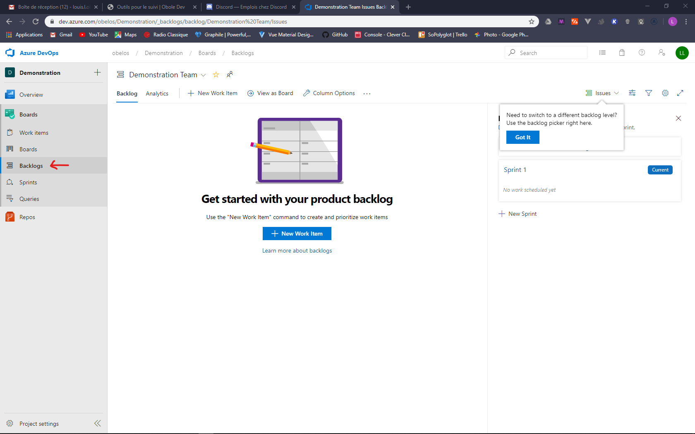
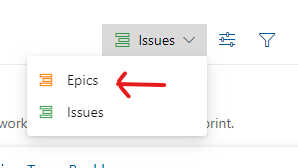
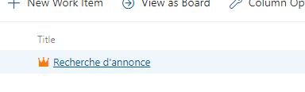
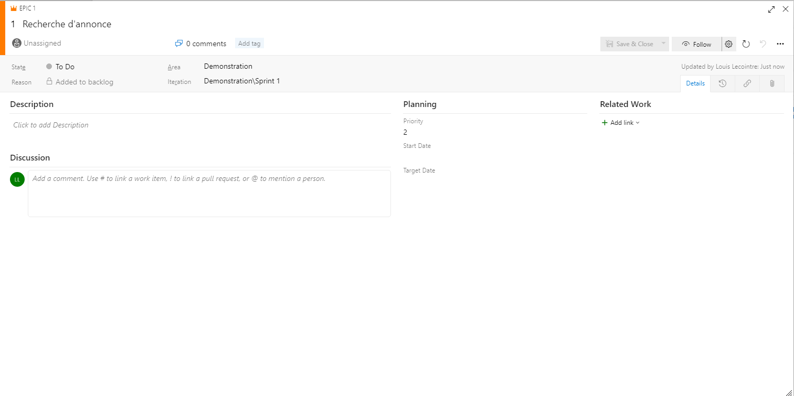

# Gérer son backlog

La gestion du backlog est la tâche la plus lourde du *product owner*. Pour faciliter cette tâches des outils et des principes rigides sont mis en place pour ce concentrer sur l'essentiel: couvrir les fonctionnalités nécessaires et les faire passer à l'équipe de développement sans laisser de portes ouvertes à l'interprétation.

## Le *backlog*
### C'est quoi le *backlog* ?
Le backlog, c'est l'ensemble des demandes du *product owner*. Il est composé d'***Epics*** - les grandes fonctionnalité du projet, eux-même découpés en ***user stories*** (ou *issues*) qui présentent des cas d'utilisation concrets
### Pour y accéder

## les *Epics*
### C'est quoi un *epic*
### Pour en créer un

## Les *User stories*
### C'est quoi une *user story* ?
### Pour en créer une